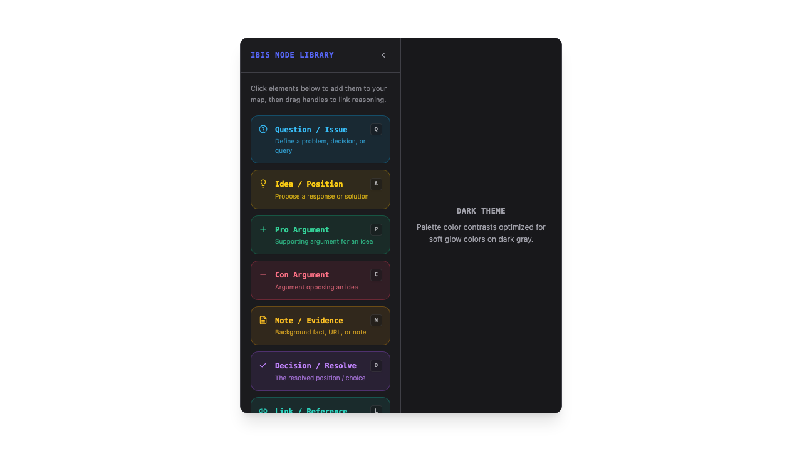
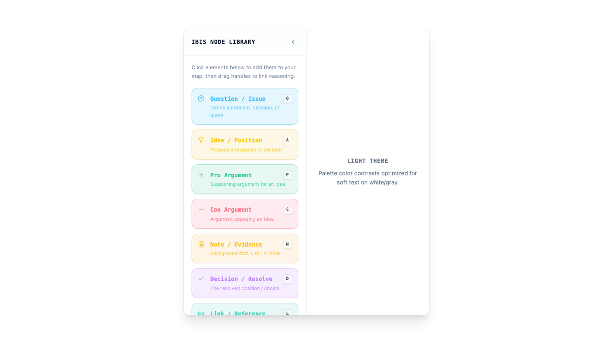
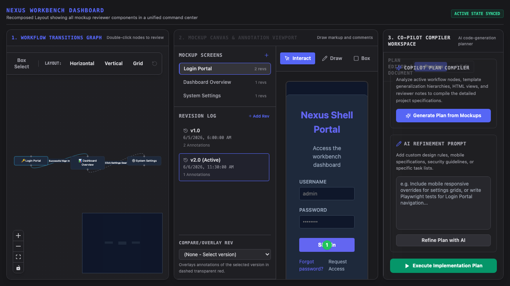
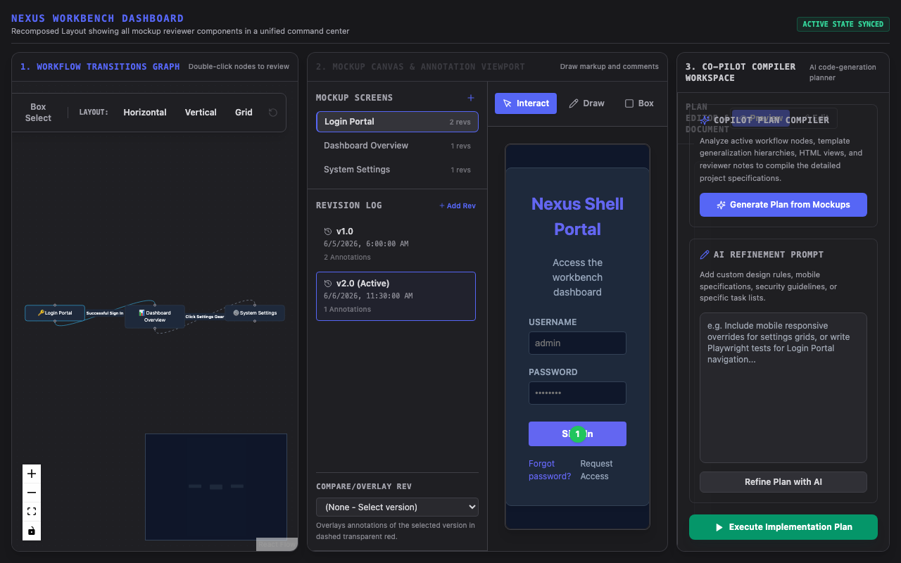

# 🚀 Nexus Shell Framework

[](https://www.npmjs.com/package/nexus-shell)
[](https://opensource.org/licenses/MIT)
[](https://github.com/techmuch/nexus-shell/actions/workflows/deploy-storybook.yml)
[](https://techmuch.github.io/nexus-shell/?path=/docs/introduction--docs)

Nexus Shell is a professional-grade, library-first React 19 / TypeScript frontend framework for building multi-panel **"Workbench"** style applications (resembling VS Code, JupyterLab, or specialized dashboard workstations). 

Instead of building a rigid layout from scratch, Nexus Shell provides a **fully decoupled, registry-driven workspace engine** powered by `flexlayout-react`, allowing tabs, menus, hotkeys, status bars, and custom sidebars to be dynamically declared and contextually composed.

---

## 📖 Live Interactive Documentation
Explore the live documentation, interactive component playground, prop definitions, and layout compositions at:
👉 **[Live Storybook Documentation Site](https://techmuch.github.io/nexus-shell/?path=/docs/introduction--docs)**

---

## 🎨 Visual Showcase & Capabilities

### 1. Tabbed Dialogue Mapping Workbench & Workspace
A flexible workstation that integrates Compendium-style visual argumentation mapping (React Flow canvas) with external node libraries and logic inspectors as drag-and-drop tabs.

*(Above: Dialogue Mapping workspace in Dark Theme showing interactive nodes, custom icons, and Straight connectors)*

### 2. Georgia Tech Theme & Theme-Adaptivity
Fully responsive styling driven by HSL CSS variables, conforming to WCAG contrast standards.

*(Above: Light Theme workspace showing responsive menus, active tab headers, and the account widget)*

### 3. Workflow Reviews & Mockup Canvas Overlay
Draw overlay annotations directly onto child mockups and generate implementation plans dynamically using AI nodes.

*(Above: A complex Mockup Reviewer workstation running canvas drawing tools and terminal consoles side-by-side)*

### 4. Interactive Storybook Workspace
Reorganized story taxonomy allowing you to build, test, and preview widgets in isolation or combined.


---

## 🤔 Why Choose Nexus Shell?

| If you are building... | Nexus Shell provides... |
| :--- | :--- |
| **IDE/Workbench Web Apps** | A complete drag-and-drop tab layout engine with splits, resizing, and sidebars (`flexlayout-react` integration). |
| **Modular Dashboard Interfaces** | Inversion of Control registries (`componentRegistry`, `commandRegistry`, `menuRegistry`) so features register themselves dynamically. |
| **Complex Geospatial/Tactical Maps** | High-performance maps (`WargameMap`) combining `react-map-gl`, `deck.gl`, and `h3-js` for hexagonal grid overlays and MIL-STD military icons. |
| **AI Orchestration Workbenches** | State-driven workflow templates, agent nodes, and drawing canvas mockups built with React Flow. |

---

## ✨ Key Features

- **Advanced Docking Engine**: Full drag-and-drop tab management (dock, split, float, collapse) out-of-the-box.
- **Inversion of Control (IoC) Registries**: Add new menu items, hotkeys, or tab contents programmatically from anywhere in your code without touching the layout container.
- **Zustand State Persistence**: Automatically restores the user's workspace structure, theme preference, and pane configurations across page reloads.
- **Accessibility & Contrast First**: Built to look beautiful and professional under three default themes (`theme-light`, `theme-dark`, and `theme-gt` for Georgia Tech fans) while satisfying AA/AAA color contrast ratios.
- **Pre-Integrated Widgets**: A library of reusable layout widgets including terminal consoles, chat panels, tree file explorers, virtualized grids, and hex maps.

---

## 🚦 Quick Start

### 1. Installation

```bash
npm install nexus-shell
```

### 2. Basic Setup

In your main entry point (e.g., `main.tsx` or `App.tsx`):

```tsx
import React from 'react';
import ReactDOM from 'react-dom/client';
import { ShellLayout, initializeShell } from 'nexus-shell';
import 'nexus-shell/style.css'; // Essential styling properties

// Initialize core registries and default welcome workspace
initializeShell();

export default function App() {
  return (
    <div className="h-screen w-screen bg-background text-foreground">
      <ShellLayout 
        title={<div className="font-bold text-lg">My Custom IDE</div>}
      />
    </div>
  );
}

ReactDOM.createRoot(document.getElementById('root')!).render(<App />);
```

---

## 🏗 Registry-Driven Customization

Nexus Shell lets you register custom features dynamically:

### Register a Keyboard Shortcut (Command)
```typescript
import { commandRegistry } from 'nexus-shell';

commandRegistry.registerCommand({
  id: 'my-app.hello',
  label: 'Say Hello',
  keybinding: 'Control+L',
  execute: () => alert('Hello from Nexus Shell!'),
});
```

### Register a Tab Component
```typescript
import { componentRegistry } from 'nexus-shell';

componentRegistry.register('my-custom-widget', () => (
  <div className="p-4 bg-card text-card-foreground">
    <h2>Dynamic Custom Tab</h2>
    <p>This tab can be docked anywhere in the workspace!</p>
  </div>
));
```

---

## 🧪 Development & Testing

```bash
# Start Vite App & local Storybook server
npm run dev:all

# Build package artifacts (ESM, UMD, CSS, and Types)
npm run build

# Run Playwright E2E and Visual Regression tests
npx playwright test
```

---

## 📄 License

MIT © [David/TechMuch]
